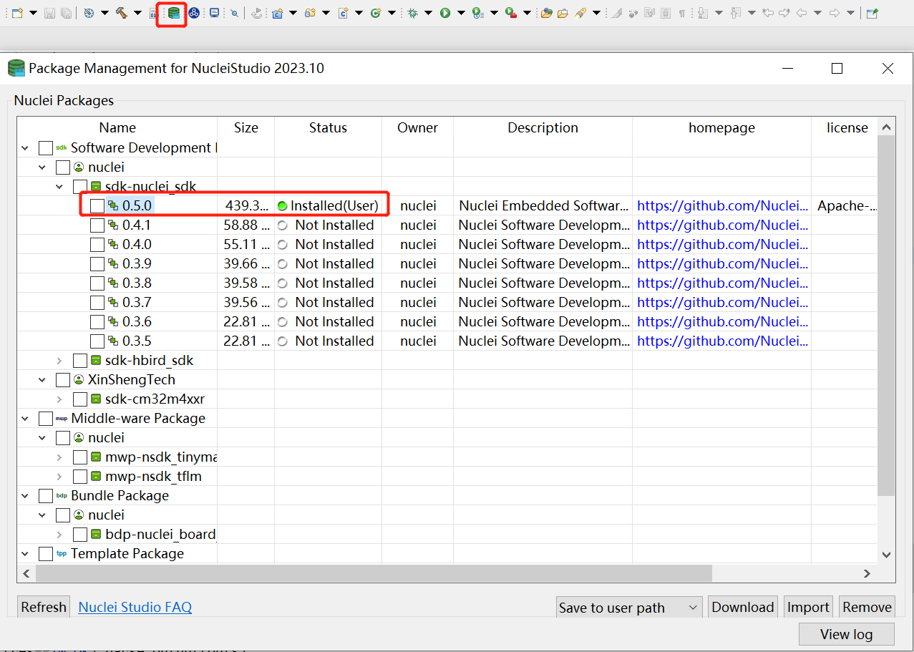
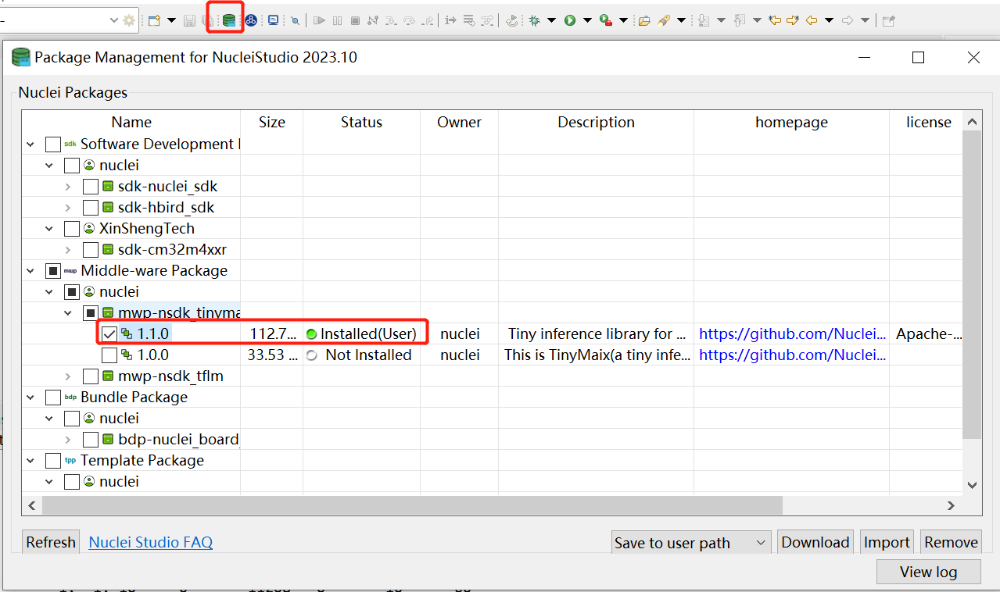
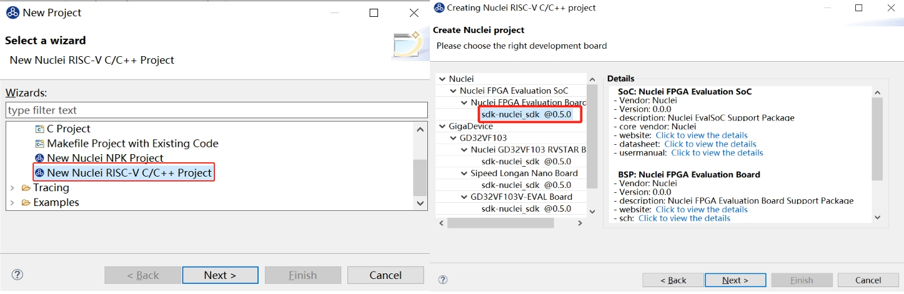
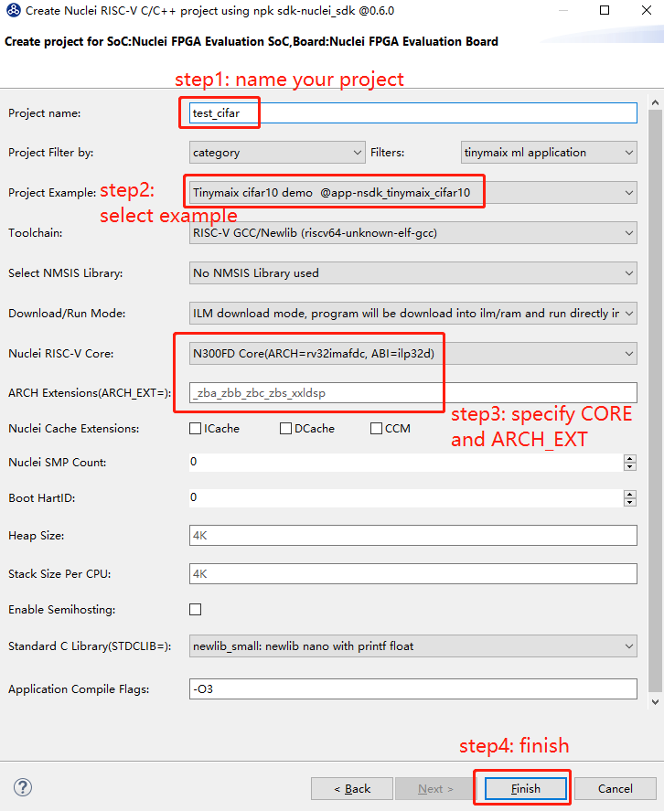
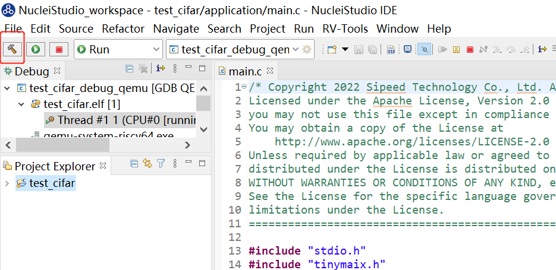
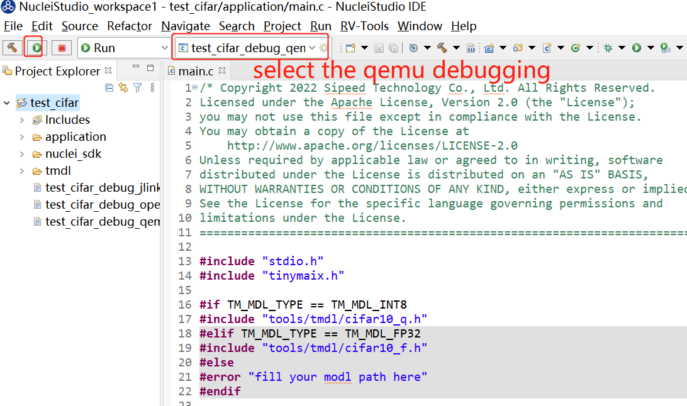

# Port TinyMaix to Nuclei RISC-V Processor

Nuclei System Technology is a RISC-V CPU IP processor vendor, click https://nucleisys.com/ to learn more.

Nuclei SDK is an open source software project to support Nuclei RISC-V CPU embedded software development,
support Nuclei 200/300/600/900 series processor, and integrated into Nuclei Studio IDE via NPK package.

TinyMaix port to Nuclei RISC-V Processor can be found in https://github.com/riscv-mcu/TinyMaix

## Test Nuclei RISC-V Processor

| Item         | Parameter      |
| ------------ | -------------- |
| CPU Core     | Nuclei 200/300/600/900 series |
| Arch         | RV32/RV64      |
| Freq         | 16MHz/100MHz   |
| Flash        | 16MBytes       |
| RAM          | ILM/DLM 512K, DDR 1.5G  |
| Acceleration | RVV 1.0, RVP 0.5.3    |

> - ILM/DLM need a 512K version bitstream.
> - Other Nuclei processor based chip can be easily supported.

# How to Use Nuclei TinyMaix Component

## 1. Use TinyMaix  in Terminal

### Board

- [Nuclei DDR200T for 200/300 CPU Series](https://nucleisys.com/developboard.php#ddr200t)
- [Xilinx VCU118 for 900 Series](https://www.xilinx.com/products/boards-and-kits/vcu118.html)

> Support can be easily ported to other Nuclei RISC-V processor based CPUs.

### Development Environment

- [Nuclei SDK](https://github.com/Nuclei-Software/nuclei-sdk)

### Operation Steps

- clone SDK

~~~shell
git clone https://github.com/Nuclei-Software/nuclei-sdk
# export NUCLEI_SDK_ROOT environment variable is required
export NUCLEI_SDK_ROOT=$(readlink -f nuclei-sdk)
# follow steps in https://doc.nucleisys.com/nuclei_sdk/quickstart.html#use-prebuilt-tools-in-nuclei-studio setup toolchain environment
~~~

- Clone Tinymaix ported for Nuclei

~~~shell
# branch: nuclei-main
git clone -b nuclei-main https://github.com/riscv-mcu/TinyMaix
~~~

- Build and run tinymaix examples

> Currently supported cases are cifar10/kws/mnist/mbnet/vww

Take cifar10 as example using Nuclei DDR200T board, N300 RISC-V CPU.

> Since the examples are ported to nuclei-sdk, so you can easily
> use it just like sdk application, see guide here
> https://doc.nucleisys.com/nuclei_sdk/quickstart.html#build-run-and-debug-sample-application

​    **a.** **Run on qemu (software simulation):**

```shell
cd TinyMaix/examples/cifar10/
# choose n300fd(rv32imafdc) as example
# DOWNLOAD mode support ilm and ddr, here use ilm mode
# clean and build project
make SOC=evalsoc CORE=n300fd DOWNLOAD=ilm clean all
# test it using qemu
make SOC=evalsoc CORE=n300fd DOWNLOAD=ilm run_qemu
```

​    **b.** **Run on FPGA Board:**

~~~shell
cd TinyMaix/examples/cifar10/
# choose n300fd(rv32imafdc) as example
# DOWNLOAD mode support ilm and ddr
# clean and build project
make SOC=evalsoc CORE=n300fd DOWNLOAD=ilm clean all
# connect fpga board, and program bitstream using xilinx vivado tools
# connect using hbird debugger to fpga board
# download program to fpga board, and monitor on com port
make SOC=evalsoc CORE=n300fd DOWNLOAD=ilm upload
~~~

**Note:** Default ilm/dlm size in evalsoc is 64K/64K, to run these cases, size for ilm/dlm should be changed to 512K/512K (code is as follows) or download to ddr (use DOWNLOAD=ilm), If run on hardware, please make sure the hardware is configured with 512K ILM/DLM or ddr.

~~~sh
$vi /path/to/nuclei_sdk/SoC/evalsoc/Board/nuclei_fpga_eval/Source/GCC/gcc_evalsoc_ilm.ld

OUTPUT_ARCH( "riscv" )

ENTRY( _start )

MEMORY
{
  ilm (rxa!w) : ORIGIN = 0x80000000, LENGTH = 512K  # change 64K to 512K
  ram (wxa!r) : ORIGIN = 0x90000000, LENGTH = 512K  # change 64K to 512K
}
~~~

## 2. Use TinyMaix  in Nuclei Studio IDE

### Development Environment

- Nuclei SDK
- Nuclei Studio
- TinyMaix

### Operation Steps

- Download Nuclei Studio IDE from [Nuclei Studio](https://www.rvmcu.com/nucleistudio.html)

- Download TinyMaix zip package from [TinyMaix](https://github.com/riscv-mcu/TinyMaix/tree/nuclei-main/)

- Open the Nuclei Studio IDE

- Download a Nuclei SDK package of version >= 0.4.0 from the Nuclei Package Management

  > **Note:**  Another way is supported that import SDK zip package which can be obtained from [Nuclei SDK](https://github.com/Nuclei-Software/nuclei-sdk) through Nuclei Package Management in the IDE. And make sure only one version of Nuclei SDK can be installed.

  

- Import the zip package of **TinyMaix** in the same way after the steps above are ready

  

- Create a new Nuclei RISC-V C/C++ Project (refer to the [Nuclei IDE User Guide](https://www.nucleisys.com/upload/files/doc/nucleistudio/Nuclei_Studio_User_Guide_202212.pdf ) if necessary)

  a. Choose the SoC, board and the SDK.

  

   b. Find the example you want and fill the configuration items

  > **Note:** Users can filter by tinymaix (or ai or tinyml) to find the example  more quickly.

  

- Build and run

   a. Clip the "Build" button to build the project

  > **Note:** Size for ilm and ram should be set big enough as nessessary, or the compilation will fail.

  

   b. Select qemu debugging and clip the "Run" button

  


**Note:**If you met issue like this: `section \`.text' will not fit in region `ilm'`, this is caused generally by ilm/dlm size not big enough to store the code, please change the ilm/dlm size from 64K/64K to 512K/512K. If run on hardware, please make sure the hardware is configured with 512K ILM/DLM.

~~~sh
# IDE: nuclei_sdk/SoC/evalsoc/Board/nuclei_fpga_eval/Source/GCC/gcc_evalsoc_ilm.ld
OUTPUT_ARCH( "riscv" )

ENTRY( _start )

MEMORY
{
  ilm (rxa!w) : ORIGIN = 0x80000000, LENGTH = 512K  # change 64K to 512K
  ram (wxa!r) : ORIGIN = 0x90000000, LENGTH = 512K  # change 64K to 512K
}
~~~

If 512K ILM/DLM still does not meet for some cases(such as mbnet), change the download mode to ddr, make sure the hardware support ddr if run on hardware.

## Result

### N300 16MHz

| config | mnist | cifar | vww  | kws |
| ------ | ----- | ----- | ------ | -------- |
| RV32IMAFDC | 11.098 | 794.764 | 2948.738 | 151.968 |

> **Note:** Other CPU series can be easily tested using Nuclei SDK
> using different fpga bitstream.

## Author

[Huaqi Fang](https://github.com/fanghuaqi)

[Jiuling Sun](https://github.com/sunjiuling)
