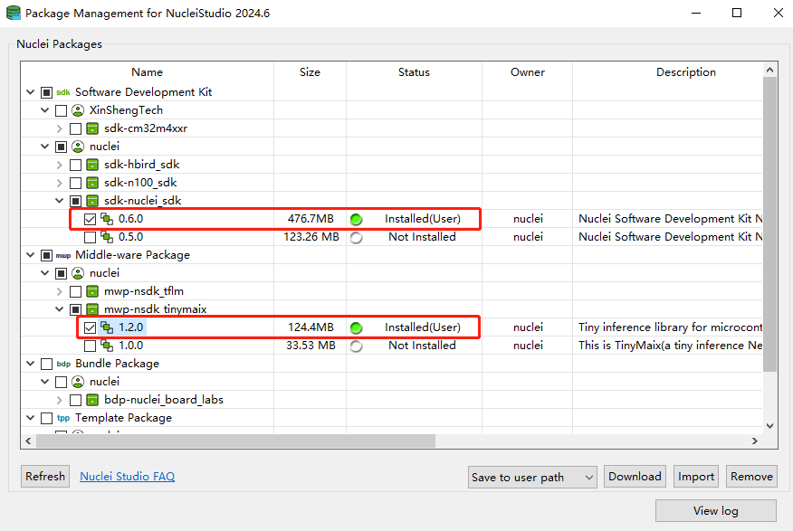
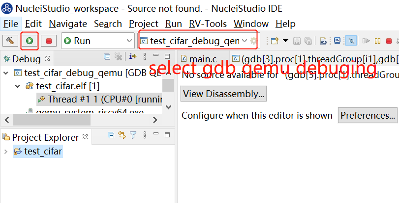

# Port TinyMaix to Nuclei RISC-V Processor

Nuclei System Technology is a RISC-V CPU IP processor vendor, click https://nucleisys.com/ to learn more.

Nuclei SDK is an open source software project to support Nuclei RISC-V CPU embedded software development,
support Nuclei 200/300/600/900 series processor, and integrated into Nuclei Studio IDE via NPK package.

TinyMaix port to Nuclei RISC-V Processor can be found in https://github.com/Nuclei-Software/npk-tinymaix

## Test Nuclei RISC-V Processor

| Item         | Parameter      |
| ------------ | -------------- |
| CPU Core     | Nuclei 200/300/600/900 series |
| Arch         | RV32/RV64      |
| Freq         | 16MHz/100MHz   |
| Flash        | 16MBytes       |
| RAM          | ILM/DLM 512K, DDR 1.5G  |
| Acceleration | RVV 1.0, RVP 0.5.4    |

> - ILM/DLM need a 512K version bitstream.
> - Other Nuclei processor based chip can be easily supported.

# How to Use TinyMaix optimized for Nuclei RISC-V Processor

We provide different ways to explore the tinymaix examples, you can use it in following ways:

1. Use tinymaix with Nuclei SDK in terminal, using Nuclei SDK's make build system, and use example with Makefile,
   and enjoy the ease with Nuclei SDK.
2. Use tinymaix with Nuclei Studio IDE, just import the prebuilt tinymaix npk package, and use project wizard to
   create sample tinymaix example, and use it in IDE.

**Important Notice**: Most of the examples are not able to be built with default linker script with only 64K ILM/DLM
size, please change it to 512K ILM/DLM by hand, and make sure it match with your cpu ilm/dlm configuration in hardware.

## 1. Use TinyMaix in Terminal with Nuclei SDK

### Board

- [Nuclei DDR200T for 200/300 CPU Series](https://nucleisys.com/developboard.php#ddr200t)
- [Xilinx VCU118 for 900 Series](https://www.xilinx.com/products/boards-and-kits/vcu118.html)

> Support can be easily ported to other Nuclei RISC-V processor based CPUs.

### Development Environment

- [Nuclei SDK](https://github.com/Nuclei-Software/nuclei-sdk)

### Operation Steps

- Clone Nuclei SDK

~~~shell
git clone https://github.com/Nuclei-Software/nuclei-sdk
# export NUCLEI_SDK_ROOT environment variable is required
export NUCLEI_SDK_ROOT=$(readlink -f nuclei-sdk)
~~~

Make sure you have followed the steps in https://doc.nucleisys.com/nuclei_sdk/quickstart.html#use-prebuilt-tools-in-nuclei-studio setup toolchain environment.

- Clone Tinymaix ported for Nuclei

~~~shell
# branch: nuclei-main
git clone -b nuclei-main https://github.com/Nuclei-Software/npk-tinymaix.git
~~~

- Build and run tinymaix examples

> Currently supported cases are cifar10/kws/mnist/mbnet/vww

Take cifar10 as example using Nuclei DDR200T board, N300 RISC-V CPU.

> Since the examples are ported to nuclei-sdk, so you can easily
> use it just like sdk application, see guide here
> https://doc.nucleisys.com/nuclei_sdk/quickstart.html#build-run-and-debug-sample-application

Here in these examples' Makefile, if you built with `DOWNLOAD=ilm`, build system will use a 512K ilm/dlm linker script file,
see `examples/gcc_512K.ld` and `examples/Makefile.common`, so if you want to change the linker script file, please change to
this one.

**Run on qemu (software simulation):**

~~~shell
cd TinyMaix/examples/cifar10/
# choose n300fd(rv32imafdc) as example
# DOWNLOAD mode support ilm and ddr, here use ilm mode
# clean and build project
make SOC=evalsoc CORE=n300fd DOWNLOAD=ilm clean all
# test it using qemu
make SOC=evalsoc CORE=n300fd DOWNLOAD=ilm run_qemu
~~~

**Run on FPGA Board:**

~~~shell
cd TinyMaix/examples/cifar10/
# choose n300fd(rv32imafdc) as example
# DOWNLOAD mode support ilm and ddr
# clean and build project
make SOC=evalsoc CORE=n300fd DOWNLOAD=ilm clean all
# connect fpga board, and program bitstream using xilinx vivado tools
# connect using hbird debugger to fpga board
# download program to fpga board, and monitor on com port
make SOC=evalsoc CORE=n300fd DOWNLOAD=ilm upload
~~~

## 2. Use TinyMaix in Nuclei Studio IDE

### Development Environment

- Nuclei SDK 0.6.0
- Nuclei Studio 2024.06
- TinyMaix 1.2.0

### Operation Steps

- Download Nuclei Studio IDE from [Nuclei Studio](https://www.rvmcu.com/nucleistudio.html)

- Open the Nuclei Studio IDE

- Download TinyMaix zip package from [TinyMaix](https://github.com/Nuclei-Software/npk-tinymaix/releases/tag/1.0.0)
  or `mwp-nsdk_tinymaix` package from Nuclei Package Management in Nuclei Studio IDE

- Download a Nuclei SDK package, version **0.6.0** from the Nuclei Package Management in Nuclei Studio IDE

  > **Note:**
  > Another way is supported that import SDK zip package which can be obtained from [Nuclei SDK](https://github.com/Nuclei-Software/nuclei-sdk) 
  > through Nuclei Package Management in the IDE. And make sure only one version of Nuclei SDK can be installed.

  

- Import the zip package of **TinyMaix** in the same way after the steps above are ready
- Create a new Nuclei RISC-V C/C++ Project (refer to the [Nuclei IDE User Guide](https://www.nucleisys.com/upload/files/doc/nucleistudio/Nuclei_Studio_User_Guide_202212.pdf) if necessary)

  a. Choose the SoC, board and the SDK.

  

   b. Find the example you want and fill the configuration items

  

  > **Note:**
  >
  > - Users can filter by tinymaix (or ai or tinyml) to find the example  more quickly；
  > - More information about the extension types may refer to [arch-ext](https://doc.nucleisys.com/nuclei_sdk/develop/buildsystem.html#arch-ext).

- Build and run

   a. Click the "Build" button to build the project

  > **Note:**
  > - Size for ilm and ram should be set big enough at least 512K as nessessary, or the compilation will fail；
  > - You need to change the `nuclei_sdk/SoC/evalsoc/Board/nuclei_fpga_eval/Source/GCC/evalsoc.memory` link script manually, change the value of `ILM_MEMORY_SIZE` and `DLM_MEMORY_SIZE` from 0x10000 to 0x80000；
  > - And make sure your cpu ilm/dlm configuration also match with the changes.

  

   b. Select qemu debugging and click the "Run" button

  

**Note:** If you meet an issue like this: `section .text will not fit in region ilm`, this is caused generally by ilm/dlm size not big enough to store the code,
          please change the ilm/dlm size from 64K/64K to 512K/512K. If run on hardware, please make sure the hardware is configured with 512K ILM/DLM.

~~~linkscript
# IDE: nuclei_sdk/SoC/evalsoc/Board/nuclei_fpga_eval/Source/GCC/evalsoc.memory
/* ILM Memory Information */
ILM_MEMORY_PRESENT = 1;
ILM_MEMORY_BASE = 0x80000000;
ILM_MEMORY_SIZE = 0x80000;

/* DLM Memory Information */
DLM_MEMORY_PRESENT = 1;
DLM_MEMORY_BASE = 0x90000000;
DLM_MEMORY_SIZE = 0x80000;
~~~

If 512K ILM/DLM still does not meet for some cases(such as mbnet), change the download mode to ddr, make sure the hardware support ddr if run on hardware.

## Result

### N300 series

- bitstream: n300_best_config_ddr200t_16M_e0a87d523_76bbb5c19_202405131346.bit
- Board: [Nuclei DDR200T](https://www.nucleisys.com/developboard.php#ddr200t)
- CPU clock: 16MHz

#### Example cifar10		

| RUNCONFIG |	rv32imafdcp |	rv32imafdc |	rv32imac | rv32imafc |
| -- | -- | -- | -- | -- |
| freq/HZ	  |  16000942 | 16000942	| 16000942	| 16002252 |
| param/KB	|  88.4	    | 88.4	    | 88.4	    | 88.4     |
| OPS/MOPS	|  3.08	    | 3.08	    | 3.08	    | 3.08     |
| buffer/KB	|  11.0	    | 11.0	    | 11.0	    | 11.0     |
| time/ms	  |  302.732	| 795.765	  | 1069.349	| 800.260  |
| cycles	  |  4843997	| 12732989	| 17110591	| 12805962 |

#### Example kws

| RUNCONFIG |	rv32imafdcp |	rv32imafdc |	rv32imac | rv32imafc |
| -- | -- | -- | -- | -- |
| freq/HZ	  | 16000942	| 16000942	| 16000942	| 16000942 |
| param/KB	| 8.3	      | 8.3	      | 8.3	      | 8.3 |
| OPS/MOPS	| 0.24	    | 0.24	    | 0.24	    | 0.24 |
| buffer/KB	| 5.0	      | 5.0	      | 5.0	      | 5.0 |
| time/ms	  | 120.228	  | 150.499	  | 412.847	  | 154.872 |
| cycles	  | 1923761	  | 2408125	  | 6605940	  | 2478097 |

#### Example mnist	

| RUNCONFIG |	rv32imafdcp |	rv32imafdc |	rv32imac | rv32imafc |
| -- | -- | -- | -- | -- |
| freq/HZ	  |	16002580	| 15999959	| 16000286	| 16000942 |
| param/KB	|	1.9	      | 1.9	      | 1.9	      | 1.9 |
| OPS/MOPS	|	0.02	    | 0.02	    | 0.02	    | 0.02 |
| buffer/KB	|	1.4	      | 1.4	      | 1.4	      | 1.4 |
| time/ms	  |	7.640	    | 11.025	  | 41.815	  | 13.781 |
| cycles	  |	122259	  | 176399	  | 669051	  | 220508 |

#### Example vww		

| RUNCONFIG |	rv32imafdcp |	rv32imafdc |	rv32imac | rv32imafc |
| -- | -- | -- | -- | -- |
| freq/HZ	  |	16000942	| 16000942	| 16000942	| 16000942 |
| param/KB	|	224.6	    | 224.6	    | 224.6	    | 224.6 |
| OPS/MOPS	|	7.49	    | 7.49	    | 7.49	    | 7.49 |
| buffer/KB	|	54.0	    | 54.0	    | 54.0	    | 54.0 |
| time/ms	  |	1470.737	| 2761.870	| 10507.108	| 2790.050 |
| cycles	  |	23533177	| 44192521	| 168123625	| 44643428 |

> **Note:** Other CPU series can be easily tested using Nuclei SDK
> using different fpga bitstream.

## FAQ

If you have questions or troubles when following this guideline, please check this issues,
if not solved, you can open a new issue, maybe community could help with you.

## Author

[Huaqi Fang](https://github.com/fanghuaqi)

[Jiuling Sun](https://github.com/JoleenSun)
